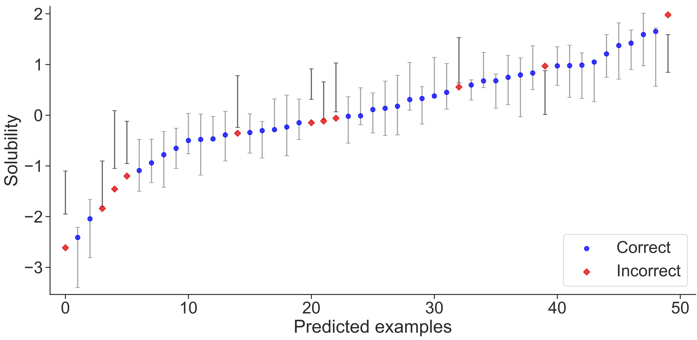
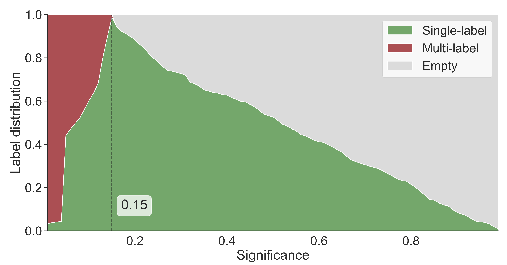
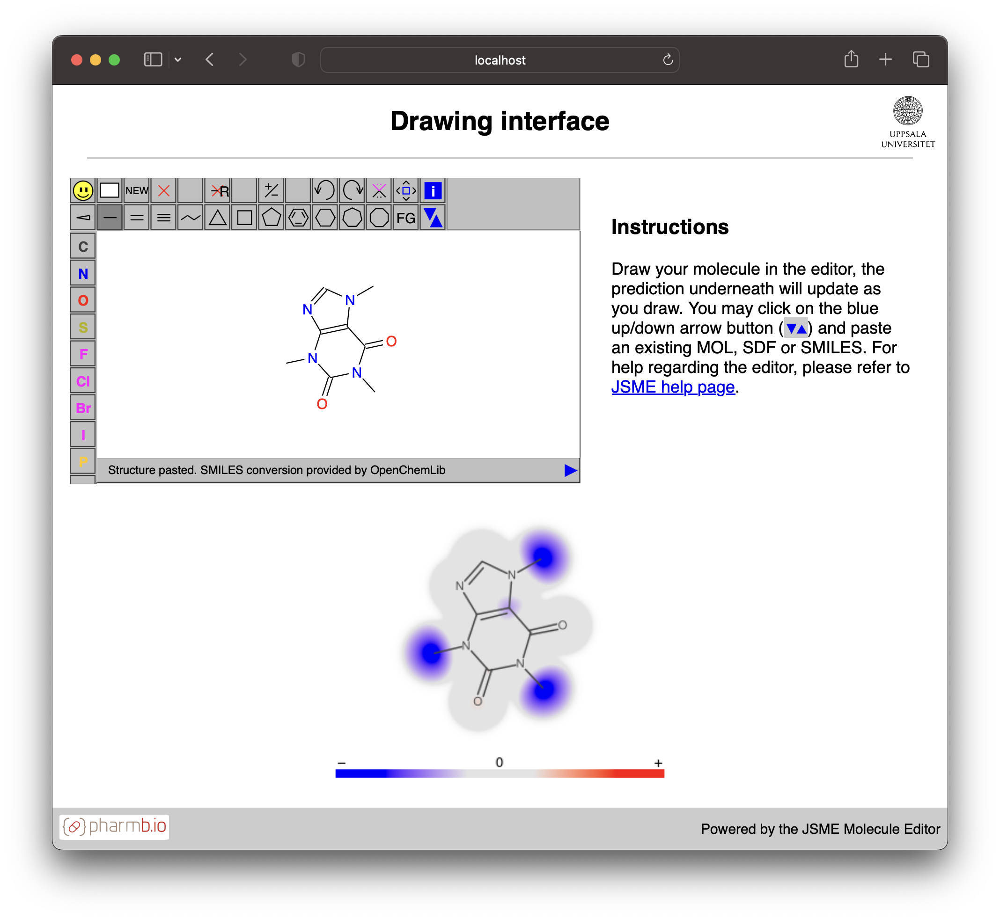

# CPSign 

Conformal Prediction <br>
with the signatures molecular descriptor and SVM. <br>
(C) Copyright 2022, Aros Bio AB, [arosbio.com](https://arosbio.com)

## Table of Contents <!-- omit in toc -->
- [Introduction](#introduction)
- [License](#license)
- [How to run CPSign](#how-to-run-cpsign)
    - [CLI/terminal](#running-from-cli)
    - [API](#running-from-java-api)
- [Java version](#java-version)
- [Changelog](#changelog)
- [Software extensions](#extension-packages)
    - [Plot utils](#plot_utils)
    - [Micro services](#micro-services)
    - [Deep learning models](#deeplearning4j-extension)
- [Building](#building)
- [Developer info](#developer-info)


## Introduction
CPSign is a machine learning and QSAR software package written purely in Java, leveraging the popular [LIBSVM](https://github.com/cjlin1/libsvm) and [LIBLINEAR](https://github.com/bwaldvogel/liblinear-java) packages for machine learning and the [Chemistry Development Kit (CDK)](https://cdk.github.io/) for handling chemistry. CPSign allows directly reading in molecular data in CSV format (requiring SMILES for molecular structure) or SDF (v2000 and v3000), computing descriptors and building machine learning models. The generated model files contain all information for later predicting new compounds without having to manually compute descriptors and apply data transformations. CPSign implements the inductive [Conformal Prediction](http://www.alrw.net/) algorithms ICP and ACP (or their more recent name; Split Conformal Predictors) for both classification and regression problems, as well as transductive conformal prediction (TCP) and [Cross Venn-ABERS](http://www.alrw.net/articles/13.pdf) probabilistic prediction for binary classification problems. Being written in Java makes it platform-independent, and the LIBLINEAR/LIBSVM methods runs on CPU which makes it easy to run without requiring any special hardware. 

## License
CPSign is dual licensed, where the user can choose between the [GNU General Public License](http://www.gnu.org/licenses/gpl-3.0.html) with additional terms (which can be found at the [Aros Bio website](https://arosbio.com/cpsign/license)) or a [commercial license](license/META-INF/comm-license.txt). See further details at the [Aros Bio website](https://arosbio.com/cpsign/license).

## How to run CPSign
CPSign can be run in two main ways; 1. as a [Command Line Interface (CLI)](#running-from-cli) tool and 2. using the [Java API](#running-from-java-api). In the following sections there are more details of how to run it in each of these ways.

### Running from CLI
To run CPSign from the CLI you need both the CPSign code and all the required dependencies. For user convenience a "fat jar" (i.e., a JAR including all dependencies) can be downloaded from the [GitHub release page](https://github.com/arosbio/cpsign/releases) for each released version of CPSign. The software is currently named using a `cpsign-{version}-fatjar.jar` naming scheme. This JAR file and Java of version 11 or higher is all you need to run the application from the CLI. Once downloaded you can run CPSign using the standard way of running java in terminal environment;
```
java -jar <path-to-jar> <arguments>
```
Which also supports adding any releavant JVM parameters. For Unix-based platforms the JAR supports running it as an executable file, but GitHub strips execute-privileges from the file when downloading it. If the user adds execute privilege (e.g., `"chmod +x <file>"`) then CPSign can be run using;
```
./<path-to-jar> <arguments>
```

Working with CPSign from the CLI the general workflow is running the following programs: `precompute`, `train`, `test`/`validate`, with the optional step of performing hyper-parameter tuning using either `tune-scorer` or `tune`. More information is found on the [CPSign web-page](https://arosbio.com/cpsign/docs/latest/).


### Running from Java API
To run CPSign from the Java API we recommend that you use [maven](https://maven.apache.org/) or similar build system to handle package dependencies. All released versions from version `2.0.0-rc1` are found on [maven central repository](https://central.sonatype.com/namespace/com.arosbio) and can be included in your own code base by adding the dependency:
```html
<dependency>
    <groupId>com.arosbio</groupId>
    <artifactId>cpsign</artifactId>
    <version>2.0.0-rc1</version>
</dependency>
```

or by replacing the `artifactId` to the required sub-module of your liking (`confai`, `cpsign-api`, etc). Programming examples can be found in the separate [CPSign examples](https://github.com/arosbio/cpsign-examples) repository to get your started.


### Sub-projects / maven child modules
In order to minimize memory footprint, the project has been split up into several sub-modules, making it possible to only use as much of the code base that is needed. I.e., the [ConfAI](confai/README.md) includes all data processing and modeling, but without including the large [CDK](https://cdk.github.io/) package which is only needed when handling chemistry. The [CPSign-API](cpsign-api/README.md) is for users that deals with chemical data, but wish to use the Java API instead of the terminal CLI.

### The available child-projects:
* [depict](depict/README.md) - An extension of the CDK depictions code which allows for generating 'blooming' molecules - i.e. visually appealing depictions with highlights that fade of and mix. Intended mainly for displaying which atoms contributed the most in a given prediction.
* [fast-ivap](fast-ivap/README.md) - An implementation of the algorithms detailed in [Vovk et al. 2015](http://alrw.net/articles/13.pdf) that pre-computes the isotonic regression used in the Venn-ABERS algorithm.
* [encrypt-api](encrypt-api/README.md) - **Moved to a separate project, not a child module any more**. A single interface for including encryption of saved prediction models or precomputed data sets. Contact [Aros Bio](https://arosbio.com) in case you wish to purchase such an extension that secures models by only allowing predictions when also having the encryption key.
* [test-utils](test-utils/REAME.md) - Project that include test resources such as SVMLight files and some QSAR datasets used in the tests.
* [confai](confai/README.md) - Conformal and probabilistic predictors, data, processing etc, excluding CDK and chemistry specific code. Thus provides a software package that allows training CP and Venn-ABERS models for non-chemical data, without the overhead of including the complete CDK package.
* [cpsign-api](cpsign-api/README.md) - Java API of CPSign, including chemistry and the CDK library.
* [cpsign](cpsign/README.md) - Final CLI version of CPSign.


Note: The documentation of CPSign is located in a separate [CPSign docs repo](https://github.com/arosbio/cpsign_docs).

## Java version
CPSign is written and developed on Java 11, but can with a few changes compile and run on Java 8. __Note__: the tests for the [cpsign](cpsign/README.md) project relies on the [System Rules](https://stefanbirkner.github.io/system-rules/) library, which in turn uses the deprecated (from Java 17) `SecurityManager` interface - causing either an excessive amount of error logs or completely fails, depending on which Java version 17-19 that you use. However, cpsign can still be built and run using the latest versions of Java.

## Changelog
A changelog can now be found in [changlog](changelog.md).

## Extension packages

### Plot_utils
In order to visualize the predictions from the conformal predictors we have created a python library for this task, located at [GitHub Plot_utils](https://github.com/pharmbio/plot_utils), building ontop of the Matplotlib and numpy libraries. This way visualizations can be customized easily and in a high abstraction level. We have also created functions for loading results from CPSign to make it easy for users to evaluate their predictive models. Example figures generated using Plot_utils for displaying the prediction intervals at a single confidence level;



and the distribution of prediction sets depending on the confidence level, which allows the user to pick an appropriate confidence level as well as assessing the predictive efficiency of a given model.


More examples of figures and metrics that can be calculated are shown in the [jupyter notebooks](https://github.com/pharmbio/plot_utils/tree/master/python), which also detail how to work with results from CPSign. 

### Micro services
CPSign predictive models can be deployed as micro services using the [Predict services extension](https://github.com/arosbio/cpsign_predict_services), which exposes a REST interface for each deployed model. The servers can optionally be exteneded with a drawing interface:



Where molecules can be inserted and altered in the JSME editor in the upper left corner and the atom-constributions are rendered in the bottom figure. Further information can be found in the dedicated repository (https://github.com/arosbio/cpsign_predict_services).

### DeepLearning4J extension
CPSign can be extended with custom extensions for, e.g., chemical descriptors and machine learning models. We have created such an extension for including deep neural networks as underlying machine learning model: [CPSign-DL4J](https://github.com/arosbio/cpsign-dl4). This extension requires building the extension for your intended platform/hardware and is more dependent on hyper-parameter tuning in order to achieve good predictive performance. The [DeepLearning4J](https://deeplearning4j.konduit.ai/) package requires running native code and is considerably larger than the other packages included in CPSign, and is thus not included in the standard version of CPSign. 


## Building
This section is for the advanced user, that themselves wish to change and update the code. For standard usage we refer to downloading the released versions from either [GitHub release page](https://github.com/arosbio/cpsign/releases) or the [maven central repository](https://central.sonatype.com/namespace/com.arosbio). The project is built and managed using [Maven](https://maven.apache.org/). The build has three profiles;
1. default (id = `thinjar`) builds and package only the application code of each maven module.
2. id = `fatjar` which builds an über/fat jar with all third-party dependencies bundled in a single JAR file. (only applicable for the [cpsign](cpsign/README.md) module).
3. id = `deploy` which assembles all sources, javadoc and thin jars, signs all artifacts and deploys everything to maven central repository. **Note: this should only be run once there is a new release to be made.** This also assumes configurations that are set in the .github/workflows and requires GitHub secrets to run successfully. 

### Building thin jars
This is the default build which used for only assembling the application codes and the pom's of each sub project. This works well in case you wish to use cpsign programmatically and using maven for resolving dependencies. This build is triggered by running;
```
mvn package 
``` 
or, alternatively (if you do not wish to run the tests):
```
mvn package -DskipTests=true
```
from either the parent (root) project, or from one of the sub projects. 

### Building a fat/über jar
This build is triggered by adding the profile `fatjar` by running;
```
mvn package -P fatjar
```
from either the parent or the [cpsign](cpsign/README.md) project. Note that this only applies to the cpsign project - this profile has no effect in any of the other projects. This build also makes the jar an "really executable jar" - i.e. on linux systems you can run the application using `./cpsign-{version}-fatjar.jar` typ calling.

__Note:__ As there is a dependence between the projects you may need to use `mvn install` instead of the `package` goal, for the "earlier" modules to be available to latter ones in the hierarchy. 


### Generating Javadoc
Depending on your use case you can either build all docs as separate jar files, e.g. by running;
```
mvn javadoc:jar
```
This can be run either from the parent (root project) in order to assemble javadoc for all sub-projects, or from the directory of the project you wish to generate javadoc for. In case you wish to have all documentation in a single jar, e.g. if you put the fat jar on your classpath instead of using maven, you can achieve this by running e.g.;
```
mvn javadoc:aggregate
# or to assemble everything into a JAR
mvn javadoc:aggregate-jar 
```
you can also alter the doc title by adding the argument `-Ddoctitle='CPSign bundle javadoc'` (or change the name to your liking) to not get the default "Parent {version} API" title. Note that this command must be executed from the parent "aggregator project".

## Developer info
### Managing releases
This section is completely for the developers to aid in deployment. Once it is time for a new release the artifact versions must be updated to be non-SNAPSHOT. This can for instance be performed running the command 
```
mvn versions:set -DnewVersion=2.0.0-rc1
```
from the root project. Once a new version is set, run the `verify_deployment.sh` script that runs the build including java-doc generation - to mimic the build in GitHub servers. Then a new git-tag that starts with `v` should be created and pushed to GitHub, e.g., by running `git tag -a v2.0.0-rc1 -m 'release candidate 1 for 2.0.0 version'` and pushed by running `git push origin --tags`. This step will trigger the build and deployment to maven central repo described in the following section.


### Deploying to Maven central
This is an automated step that is triggered by pushing a new git-tag that starts with `v` to GitHub as described above. This will trigger the github action defined in [create_release](.github/workflows/create_release.yml). This performs all necessary steps in assembly of artifacts and signing of these, as well as uploading it to the staging area for maven central through nexus, described e.g. in the [maven central guide](https://central.sonatype.org/publish/publish-maven/#releasing-to-central).

### GitHub release
This is currently a manual task that is comprised by running the following steps (run from the root project);
```
# Building the fat jar
mvn clean package -DskipTests=true -P fatjar
# Assembly of all java doc
mvn javadoc:aggregate-jar -Ddoctitle='CPSign bundle javadoc'
```
The output of the second command will be something starting with "parent" which is not what we want, instead rename it to e.g. `cpsign-{version}-fatjar-javadoc.jar`. 

Once these steps have been performed, manually create the release on github and link to the tag that you created above, and include the two generated 'fat jar' artifacts. 

### Future work
- [x] Implement isotonic regression in a Java project, to replace the [pairAdjacentViolators](https://github.com/sanity/pairAdjacentViolators) dependency which also require bundling in Kotlin standard lib - leading to an increased memory footprint of the jars.