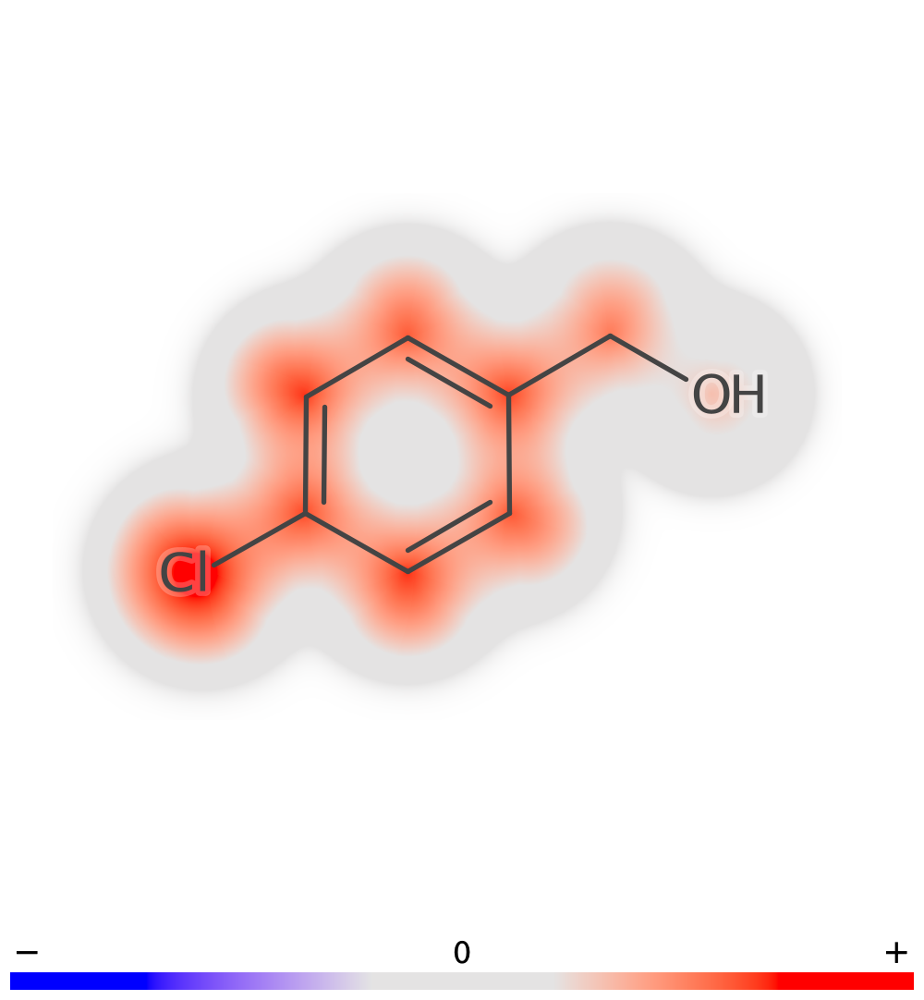

# Depict

The depict project wraps the "Bloom" rendering initially written by Arvid Berg, but here re-implemented by Staffan Arvidsson McShane. Its main goal is to generate visually appealing molecule depictions by adding custom implementations of the available CDK depiction interfaces (i.e. `IRenderingElement`, `IGenerator<IAtomContainer>` and `AWTDrawVisitor` interfaces). These are then used in tandem with CDK rendering classes in the `MoleculeDepictor` class. The rendered images can in this way be enriched with highlights that fade away depending on the van der Waals radius of each atom (see example image below). 



Note that bloom rendering is very time-consuming as it is rasterized and require calculating the color and transparency of each pixel that is "close enough" to any atom in order be taken into account.

## Building
Building is performed using Maven, and can be achieved by e.g. running the following:
```
mvn clean package
```
But this is only for stand alone usage of this package, building all the jars jointly is preferably done in the project root using the parent maven project of all child-modules.
